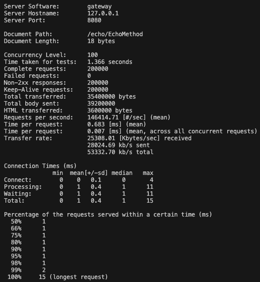
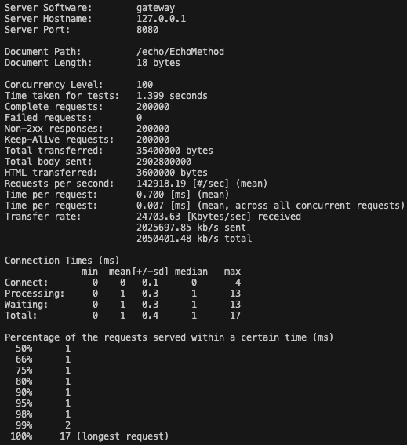
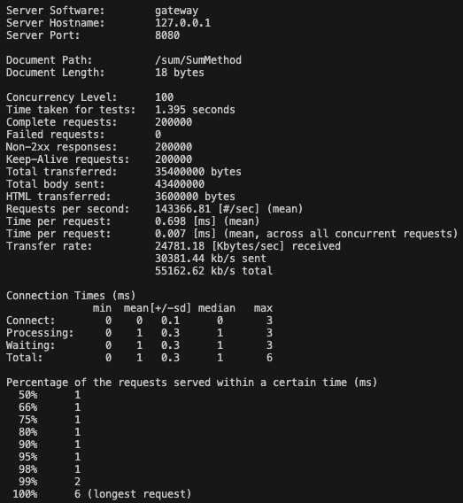

## Gateway Benchmarking
The `gateway_test_plan.jmx` is a JMeter test file that can be opened in JMeter GUI. After installing JMeter, you can open the test file, edit the test plan, and run the benchmarking test in both GUI and non-GUI mode.

The `.input` files in this directory are used for benchmark testing and load testing through Apache Bench (ab), another testing tool. After running the gateway and backend services, you can test the performance of the gateway using the following commands. The results are displayed below the respective command:

```shell
ab -n 200000 -c 100 -k -p short_message.input -T 'application/json' http://127.0.0.1:8080/echo/EchoMethod
```


```shell
ab -n 200000 -c 100 -k -p long_message.input -T 'application/json' http://127.0.0.1:8080/echo/EchoMethod
```


```shell
ab -n 200000 -c 100 -k -p sum_normal.input -T 'application/json' http://127.0.0.1:8080/sum/SumMethod
```
